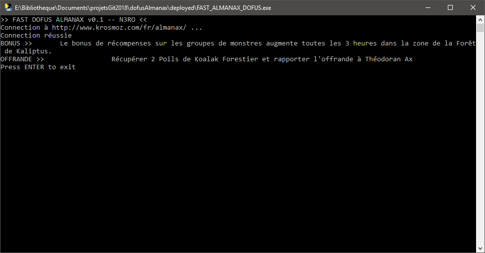

# Fast Dofus Almanax

 

Un script python qui permet de récupèrer les informations de l'almanax du jour en un clic.

## 1. Getting started
### 1.1 Prerequisites
Run `python src/main.py` and run `pip install -m <lib>` until you have all the libs.

### 1.2 How to use it
Run `python src/main.py`, or get an executable on the [release page](https://github.com/N3ROO/FastDofusAlmanax/releases).

### 1.3 Setting up your dev environment
Open your favorite code editor and you are ready to go.

## 2. Miscellaneous
### 2.1 Changelog
The changelog is available [here](CHANGELOG.md).

### 2.2 Authors
- **N3ROO** - *Initial work* - [Github](https://github.com/N3ROO) [Website](https://n3roo.github.io/)

### 2.3 License
This project is licensed under the <licensename> license - see the [LICENSE](LICENSE) file for details